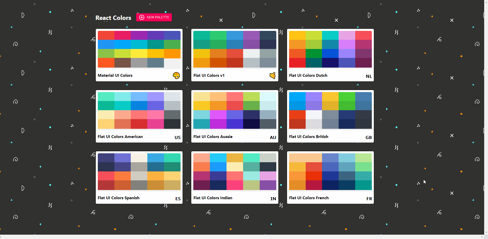
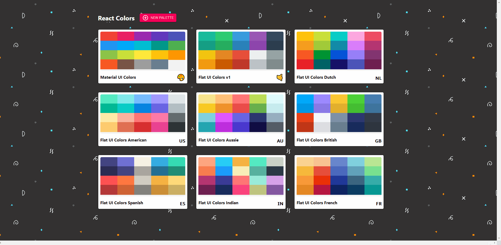
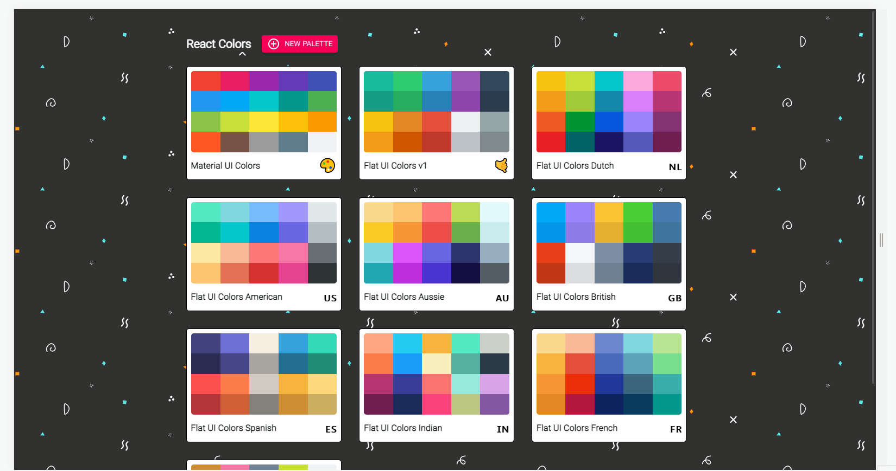

My final project from [Colt Steele's Modern React Bootcamp](https://www.udemy.com/course/modern-react-bootcamp/), with some customizations. Bootstrapped with [Create React App](https://github.com/facebook/create-react-app).

## Navigate Palettes

Choose from different color palettes and change luminosity within the palette. Choose your color format from HEX, RGB, and RGBA, and click on a color to copy its code to clipboard. You can browse different shades of a color by clicking MORE.

## Create Custom Palettes

Create your own custom color palette. Choose RANDOM COLOR to add a random color to your palette, or use the color picker to make your own custom shade. Drag and drop to order your colors. Add a unique name and emoji to your new palette.

## Created with Responsive Design

Works on different screen sizes.

## Available Scripts

In the project directory, you can run:

### `npm start`

Runs the app in the development mode.\
Open [http://localhost:3000](http://localhost:3000) to view it in the browser.

The page will reload if you make edits.\
You will also see any lint errors in the console.

### `npm test`

Launches the test runner in the interactive watch mode.\
See the section about [running tests](https://facebook.github.io/create-react-app/docs/running-tests) for more information.

### `npm run build`

Builds the app for production to the `build` folder.\
It correctly bundles React in production mode and optimizes the build for the best performance.

The build is minified and the filenames include the hashes.\
Your app is ready to be deployed!

See the section about [deployment](https://facebook.github.io/create-react-app/docs/deployment) for more information.
